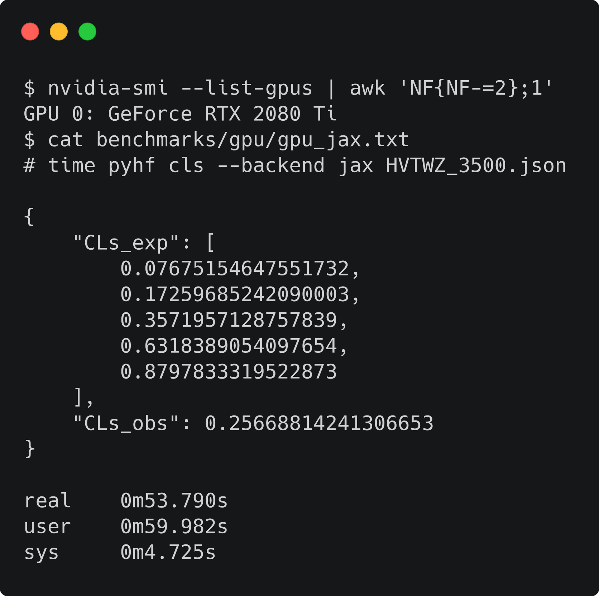

class: middle, center, title-slide
count: false

# Distributed statistical inference
# with pyhf enabled through funcX

.huge.blue[Matthew Feickert]<br>
.huge[(University of Illinois at Urbana-Champaign)]
<br><br>
[matthew.feickert@cern.ch](mailto:matthew.feickert@cern.ch)

[vCHEP 2021](https://indico.cern.ch/event/948465/)

May 20th, 2021

.middle-logo[]

---
# Notes to self and reviewers

<br><br>

- Parallel session talk on .bold[Thursday, 2021-05-20]
- Talk starts at .bold[15:13] CERN time (08:13 Illinois time)
- Talk time: .bold[8 minutes] + 5 minutes for questions
   - Need to focus on economy of time

---
# Authors

<br><br>

.grid[
.kol-1-4.center[
.circle.width-80[]

[Lukas Heinrich](https://github.com/lukasheinrich)

CERN
]
.kol-1-4.center[
.circle.width-80[]

[Matthew Feickert](https://www.matthewfeickert.com/)

Illinois
]
.kol-1-4.center[
.circle.width-80[]

[Giordon Stark](https://github.com/kratsg)

UCSC SCIPP
]
.kol-1-4.center[
.circle.width-75[]

[Ben Galewsky](https://bengalewsky.github.io/about/)

NCSA/Illinois
]
]

---
# Fitting as a Service with `pyhf` on HPCs

.kol-1-2[
- HPC facilities provide an opportunity to efficiently perform the statistical inference of LHC data
- Can pose problems with orchestration and efficient scheduling
- Want to leverage pyhf hardware accelerated backends at HPC sites for real analysis speedup
   - Reduce fitting time from hours to minutes
- Deploy a _(fitting) Function as a Service_ (FaaS) powered through funcX
- Example use cases:
   - Large scale ensemble fits for statistical combinations
   - Large dimensional scans of theory parameter space (e.g. pMSSM scans)
   - Pseudo-experiment generation ("toys")
]
.kol-1-2[
 .center.width-100[]
 ATLAS workspace that takes over an hour on ROOT fit in under 2 minutes with pyhf on GPU
]

---
# Fitting as a Service Methods and Technologies

.kol-1-2[
.center.width-50[[](https://pyhf.readthedocs.io/)]
- Pure Python implementation of the `HistFactory` statistical specification for multi-bin histogram-based analysis
- Supports multiple computational backends and optimizers (defaults of NumPy and SciPy)
- JAX, TensorFlow, and PyTorch backends can leverage _hardware acceleration_ (GPUs, TPUs) and _automatic differentiation_
- Can outperform C++ implementations of `HistFactory`
]
.kol-1-2[
.center.width-80[[](https://funcx.readthedocs.io/en/latest/)]
- High-performance FaaS platform
- Designed to orchestrate _scientific workloads_ across _heterogeneous computing resources_ (clusters, clouds, and supercomputers) and task execution providers (HTCondor, Slurm, Torque, and Kubernetes)
- Leverages [Parsl](https://parsl.readthedocs.io/) for efficient parallelism and managing concurrent task execution
- Allows users to register and then execute Python functions in "serverless supercomputing" workflow
]

---
# funcX Endpoints on HPC

.kol-2-5[
- [funcX endpoint](https://funcx.readthedocs.io/en/stable/endpoints.html): logical entity that represents a compute resource
- Managed by an agent process allowing the funcX service to dispatch user defined functions to resources for execution
- Agent handles:
   - Authentication and authorization
   - Provisioning of nodes on the compute resource
   - Monitoring and management
- .bold[Would be great to have a figure go here instead]
]
.kol-3-5[
<!--  -->
.tiny[
```python
from funcx_endpoint.endpoint.utils.config import Config
from funcx_endpoint.executors import HighThroughputExecutor

from parsl.providers import LocalProvider

...

config = Config(
    executors=[
        HighThroughputExecutor(
            label="fe.cs.uchicago",
            address=address_by_hostname(),
            provider=SlurmProvider(
                channel=LocalChannel(),
                nodes_per_block=NODES_PER_JOB,
                init_blocks=1,
                partition="general",
                launcher=SrunLauncher(
                    overrides=(
                        f"hostname; srun --ntasks={TOTAL_WORKERS} "
                        f"--ntasks-per-node={WORKERS_PER_NODE} "
                        f"--gpus-per-task=rtx2080ti:{GPUS_PER_WORKER} "
                        f"--gpu-bind=map_gpu:{GPU_MAP}"
                    )
                ),
                walltime="01:00:00",
            ),
        )
    ],
)
```
]
]

---
# Execution with funcX: Define user functions

.kol-2-3[
.tiny[
```python
import json
from time import sleep

import pyhf
from funcx.sdk.client import FuncXClient
from pyhf.contrib.utils import download


def prepare_workspace(data):
    import pyhf
    pyhf.set_backend("jax")

    return pyhf.Workspace(data)


def infer_hypotest(workspace, metadata, patches):
    import time
    import pyhf
    pyhf.set_backend("jax")

    tick = time.time()
    model = workspace.model(...)
    data = workspace.data(model)
    test_poi = 1.0
    return {
        "metadata": metadata,
        "CLs_obs": float(
            pyhf.infer.hypotest(test_poi, data, model, test_stat="qtilde")
        ),
        "Fit-Time": time.time() - tick,
    }

...
```
]
]
.kol-1-3[
    <br><br>
- As the analyst user, _define the functions_ that you want the funcX endpoint to execute
- These are run as _individual jobs_ and so require all dependencies to be defined inside them
   - e.g. `import pyhf`
]

---
# Execution with funcX: Register and run functions

.kol-2-3[
.tiny[
```python
...

def main(args):

    ...

    # Initialize funcX client
    fxc = FuncXClient()
    fxc.max_requests = 200

    with open("endpoint_id.txt") as endpoint_file:
        pyhf_endpoint = str(endpoint_file.read().rstrip())

    # register functions
    prepare_func = fxc.register_function(prepare_workspace)

    # execute background only workspace
    bkgonly_workspace = json.load(bkgonly_json)
    prepare_task = fxc.run(
        bkgonly_workspace, endpoint_id=pyhf_endpoint, function_id=prepare_func
    )

    workspace = None
    while not workspace:
        try:
            workspace = fxc.get_result(prepare_task)
        except Exception as excep:
            print(f"prepare: {excep}")
            sleep(10)

...
```
]
]
.kol-1-3[
- With the user functions defined, they can then be _registered_ with the _`funcX` client_ locally
   - `fx.register_function(...)`
- The local `funcX` client can then execute the request to the remote `funcX` endpoint, handling all communication and authentication required
   - `fx.run(...)`
- While the job run on the remote HPC system, can make periodic requests for finished results
   - `fxc.get_result(...)`
   - Returning the _output_ of the user defined functions
]

---
# Execution with funcX: Scaling out jobs

.kol-2-3[
.tiny[
```python
...

    # register functions
    infer_func = fxc.register_function(infer_hypotest)

    patchset = pyhf.PatchSet(json.load(patchset_json))

    # execute patch fits across workers and retrieve them when done
    n_patches = len(patchset.patches)
    tasks = {}
    for patch_idx in range(n_patches):
        patch = patchset.patches[patch_idx]
        task_id = fxc.run(
            workspace,
            patch.metadata,
            [patch.patch],
            endpoint_id=pyhf_endpoint,
            function_id=infer_func,
        )
        tasks[patch.name] = {"id": task_id, "result": None}

    while count_complete(tasks.values()) < n_patches:
        for task in tasks.keys():
            if not tasks[task]["result"]:
                try:
                    result = fxc.get_result(tasks[task]["id"])
                    tasks[task]["result"] = result
                except Exception as excep:
                    print(f"inference: {excep}")
                    sleep(15)

...
```
]
]
.kol-1-3[
- The workflow
   - `fx.register_function(...)`
   - `fx.run(...)`

 can now be used to scale out .bold[as many custom functions as the workers can handle]
- This allows for all the signal patches (model hypotheses) in a full analysis to be .bold[run simultaneously across HPC workers]
- The user analyst has .bold[written only simple pure Python] (no system specific configuration files needed)
]

---
# Scaling of Statistical Inference

- RIVER
- NCSA Bluewaters (CPU)
- XSEDE Expanse (GPU JAX)

---
# Performance

- Add results table

---
# Summary

- Demonstrated the ability to parallelize and accelerate statistical inference of physics analyses on
HPC systems through a FaaS solution

---
class: end-slide, center

.large[Backup]

---
# Why use funcX as opposed to Dask?

- funcX provides a _managed service_ secured by Globus Auth

- Endpoints can be set up by a site administrator and shared with authorized users through Globus Auth Groups

- [Testing has shown](https://parsl.readthedocs.io/en/stable/userguide/performance.html) that Dask struggles to .bold[scale up to thousands of nodes], whereas the funcX High Throughput Executor (HTEX) provided through [Parsl](https://parsl.readthedocs.io/) scales efficiently

[.center.width-80[]](https://parsl.readthedocs.io/en/stable/userguide/performance.html)

---
# References

1. Lukas Heinrich, .italic[[Distributed Gradients for Differentiable Analysis](https://indico.cern.ch/event/960587/contributions/4070325/)], [Future Analysis Systems and Facilities Workshop](https://indico.cern.ch/event/960587/), 2020.
2. Babuji, Y., Woodard, A., Li, Z., Katz, D. S., Clifford, B., Kumar, R., Lacinski, L., Chard, R., Wozniak, J., Foster, I., Wilde, M., and Chard, K., Parsl: Pervasive Parallel Programming in Python. 28th ACM International Symposium on High-Performance Parallel and Distributed Computing (HPDC). 2019. https://doi.org/10.1145/3307681.3325400

---

class: end-slide, center
count: false

The end.
