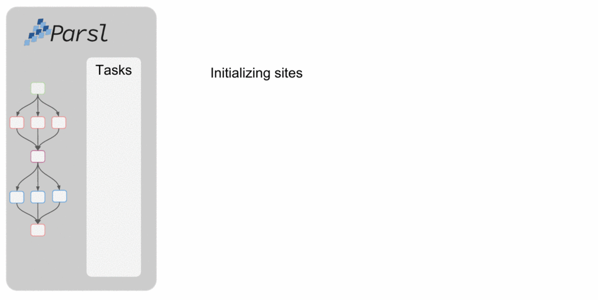
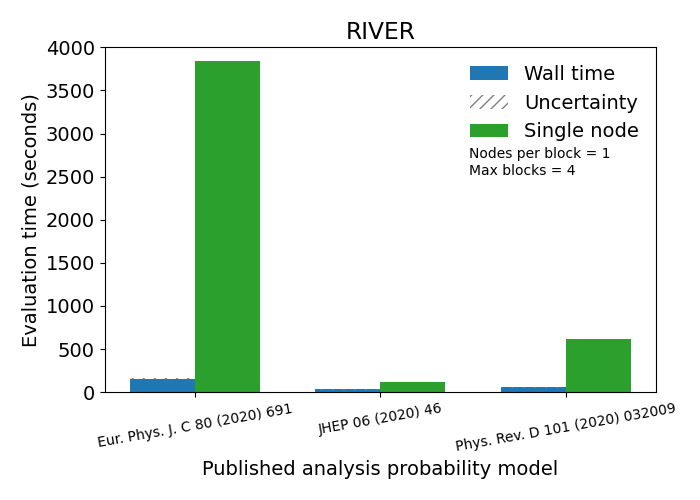
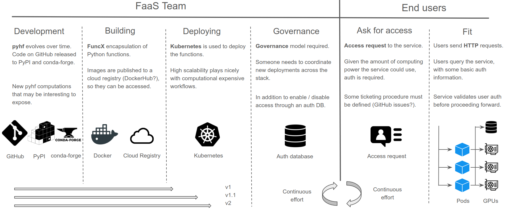

class: middle, center, title-slide
count: false

# Distributed statistical inference
# with pyhf enabled through funcX

.huge.blue[Matthew Feickert]<br>
.huge[(University of Illinois at Urbana-Champaign)]
<br><br>
[matthew.feickert@cern.ch](mailto:matthew.feickert@cern.ch)

[vCHEP 2021](https://indico.cern.ch/event/948465/contributions/4324013/)

May 20th, 2021

---
# Authors

<br><br>

.grid[
.kol-1-4.center[
.circle.width-80[]

[Lukas Heinrich](https://github.com/lukasheinrich)

CERN
]
.kol-1-4.center[
.circle.width-80[]

[Matthew Feickert](https://www.matthewfeickert.com/)

Illinois
]
.kol-1-4.center[
.circle.width-80[]

[Giordon Stark](https://github.com/kratsg)

UCSC SCIPP
]
.kol-1-4.center[
.circle.width-75[]

[Ben Galewsky](https://bengalewsky.github.io/about/)

NCSA/Illinois
]
]

---
# Fitting as a Service with `pyhf` on HPCs

.kol-1-2[
- HPC facilities provide an opportunity to efficiently perform the statistical inference of LHC data
- Can pose problems with orchestration and efficient scheduling
- Want to leverage pyhf hardware accelerated backends at HPC sites for real analysis speedup
   - Reduce fitting time from hours to minutes
- Deploy a .bold[(fitting) Function as a Service] (FaaS) powered through [funcX](https://funcx.readthedocs.io/en/latest/)
- Example use cases:
   - Large scale ensemble fits for statistical combinations
   - Large dimensional scans of theory parameter space (e.g. pMSSM scans)
   - Pseudo-experiment generation ("toys")
]
.kol-1-2[
 .center.width-90[]
 ATLAS workspace that takes over an hour on ROOT fit in under 1 minute with pyhf on local GPU
]

---
# Fitting as a Service Methods and Technologies

.kol-1-2[
.center.width-50[[](https://pyhf.readthedocs.io/)]
- Pure Python implementation of the `HistFactory` statistical specification for multi-bin histogram-based analysis
- Supports multiple computational backends and optimizers (defaults of NumPy and SciPy)
- JAX, TensorFlow, and PyTorch backends can leverage _hardware acceleration_ (GPUs, TPUs) and _automatic differentiation_
- Possible to outperform C++ implementations of `HistFactory`
]
.kol-1-2[
.center.width-80[[](https://funcx.readthedocs.io/en/latest/)]
- High-performance FaaS platform
- Designed to orchestrate _scientific workloads_ across _heterogeneous computing resources_ (clusters, clouds, and supercomputers) and task execution providers (HTCondor, Slurm, Torque, and Kubernetes)
- Leverages [Parsl](https://parsl.readthedocs.io/) for efficient parallelism and managing concurrent task execution
- Allows users to register and then execute Python functions in "serverless supercomputing" workflow
]

---
# funcX Endpoints on HPC

.kol-2-5[
<br>
- [funcX endpoint](https://funcx.readthedocs.io/en/stable/endpoints.html): logical entity that represents a compute resource
- Managed by an agent process allowing the funcX service to dispatch .bold[user defined functions] to resources for execution
- Agent handles:
   - Authentication (Globus) and authorization
   - Provisioning of nodes on the compute resource
   - Monitoring and management
]
.kol-3-5[

.tiny[
```python
from funcx_endpoint.endpoint.utils.config import Config
...

user_opts = {
    "expanse": {
        "worker_init": ". ~/setup_expanse_funcx_test_env.sh",
        "scheduler_options": "#SBATCH --gpus=1",
    }
}

config = Config(
    executors=[
        HighThroughputExecutor(
            label="Expanse_GPU",
            address=address_by_hostname(),
            provider=SlurmProvider(
                "gpu",  # Partition / QOS
                account="nsa106",
                nodes_per_block=1,
                max_blocks=4,
                init_blocks=1,
                mem_per_node=96,
                scheduler_options=user_opts["expanse"]["scheduler_options"],
                worker_init=user_opts["expanse"]["worker_init"],
                launcher=SrunLauncher(),
                walltime="00:10:00",
                cmd_timeout=120,
            ),
        ),
    ],
)
```
]
]

---
# funcX Endpoints on HPC: Config Example

.kol-1-2[
Example Parsl `HighThroughputExecutor` config (from [Parsl docs](https://parsl.readthedocs.io/en/1.1.0/userguide/execution.html#configuration)) that .bold[funcX extends]

.tiny[
```python
from parsl.config import Config
from libsubmit.providers.local.local import Local
from parsl.executors import HighThroughputExecutor

config = Config(
    executors=[
        HighThroughputExecutor(
            label='local_htex',
            workers_per_node=2,
            provider=Local(
                min_blocks=1,
                init_blocks=1,
                max_blocks=2,
                nodes_per_block=1,
                parallelism=0.5
            )
        )
    ]
)
```
]
.tiny[
- [block](https://parsl.readthedocs.io/en/1.1.0/userguide/execution.html#blocks): Basic unit of resources acquired from a provider
- [`max_blocks`](https://parsl.readthedocs.io/en/1.1.0/userguide/execution.html#elasticity): Maximum number of blocks that can be active per executor
- [`nodes_per_block`](https://parsl.readthedocs.io/en/1.1.0/userguide/execution.html#blocks): Number of nodes requested per block
- [`parallelism`](https://parsl.readthedocs.io/en/1.1.0/userguide/execution.html#parallelism): Ratio of task execution capacity to the sum of running tasks and available tasks
]
]
.kol-1-2[
.center.width-100[[](https://parsl.readthedocs.io/en/1.1.0/userguide/execution.html#configuration)]
- 9 tasks to compute
- Tasks are allocated to the first block until its `task_capacity` (here 4 tasks) reached
- Task 5: First block full and <br>`5/9 > parallelism`<br>so Parsl provisions a new block for executing the remaining tasks
]

---
# Execution with funcX: Define user functions

.kol-2-3[
.tiny[
```python
import json
from time import sleep

import pyhf
from funcx.sdk.client import FuncXClient
from pyhf.contrib.utils import download


def prepare_workspace(data, backend):
    import pyhf

    pyhf.set_backend(backend)
    return pyhf.Workspace(data)


def infer_hypotest(workspace, metadata, patches, backend):
    import time
    import pyhf

    pyhf.set_backend(backend)

    tick = time.time()
    model = workspace.model(...)
    data = workspace.data(model)
    test_poi = 1.0
    return {
        "metadata": metadata,
        "CLs_obs": float(
            pyhf.infer.hypotest(test_poi, data, model, test_stat="qtilde")
        ),
        "Fit-Time": time.time() - tick,
    }

...
```
]
]
.kol-1-3[
    <br><br>
- As the analyst user, _define the functions_ that you want the funcX endpoint to execute
- These are run as _individual jobs_ and so require all dependencies of the function to .bold[be defined inside the function]

.tiny[
```python
import numpy  # Not in execution scope

def example_function():
    import pyhf  # Import here

    ...

    pyhf.set_backend("jax")  # To use here
```
]
]

---
# Execution with funcX: Register and run functions

.kol-2-3[
.tiny[
```python
...

def main(args):

    ...

    # Initialize funcX client
    fxc = FuncXClient()
    fxc.max_requests = 200

    with open("endpoint_id.txt") as endpoint_file:
        pyhf_endpoint = str(endpoint_file.read().rstrip())

    # register functions
    prepare_func = fxc.register_function(prepare_workspace)

    # execute background only workspace
    bkgonly_workspace = json.load(bkgonly_json)
    prepare_task = fxc.run(
        bkgonly_workspace, backend, endpoint_id=pyhf_endpoint, function_id=prepare_func
    )

    workspace = None
    while not workspace:
        try:
            workspace = fxc.get_result(prepare_task)
        except Exception as excep:
            print(f"prepare: {excep}")
            sleep(10)

...
```
]
]
.kol-1-3[
- With the user functions defined, they can then be _registered_ with the _funcX client_ locally
   - `fx.register_function(...)`
- The local funcX client can then execute the request to the remote funcX endpoint, handling all communication and authentication required
   - `fx.run(...)`
- While the job run on the remote HPC system, can make periodic requests for finished results
   - `fxc.get_result(...)`
   - Returning the _output_ of the user defined functions
]

---
# Execution with funcX: Scaling out jobs

.kol-2-3[
.tiny[
```python
...

    # register functions
    infer_func = fxc.register_function(infer_hypotest)

    patchset = pyhf.PatchSet(json.load(patchset_json))

    # execute patch fits across workers and retrieve them when done
    n_patches = len(patchset.patches)
    tasks = {}
    for patch_idx in range(n_patches):
        patch = patchset.patches[patch_idx]
        task_id = fxc.run(
            workspace,
            patch.metadata,
            [patch.patch],
            backend,
            endpoint_id=pyhf_endpoint,
            function_id=infer_func,
        )
        tasks[patch.name] = {"id": task_id, "result": None}

    while count_complete(tasks.values()) < n_patches:
        for task in tasks.keys():
            if not tasks[task]["result"]:
                try:
                    result = fxc.get_result(tasks[task]["id"])
                    tasks[task]["result"] = result
                except Exception as excep:
                    print(f"inference: {excep}")
                    sleep(15)

...
```
]
]
.kol-1-3[
- The workflow
   - `fx.register_function(...)`
   - `fx.run(...)`

 can now be used to scale out .bold[as many custom functions as the workers can handle]
- This allows for all the signal patches (model hypotheses) in a full analysis to be .bold[run simultaneously across HPC workers]
   - Run from anywhere (e.g. laptop)!
- The user analyst has .bold[written only simple pure Python]
   - No system specific configuration files needed
]

---
# Scaling of Statistical Inference

.kol-1-2[
- .bold[Example]: Fitting all 125 models from `pyhf` pallet for [published ATLAS SUSY 1Lbb analysis](https://www.hepdata.net/record/ins1755298)
   - DOI: https://doi.org/10.17182/hepdata.90607
- Wall time .bold[under 2 minutes 30 seconds]
   - Downloading of `pyhf` pallet from HEPData (local machine)
   - Registering functions (local machine)
   - Sending serialization to funcX endpoint (remote HPC)
   - funcX executing all jobs (remote HPC)
   - funcX retrieving finished job output (local machine)
- Deployments of funcX endpoints currently used for testing
   - University of Chicago River HPC cluster (CPU)
   - NCSA Bluewaters (CPU)
   - XSEDE Expanse (GPU JAX)
]
.kol-1-2[
.tiny[
```
feickert@ThinkPad-X1:~$ time python fit_analysis.py -c config/1Lbb.json
prepare: waiting-for-ep
prepare: waiting-for-ep
--------------------
<pyhf.workspace.Workspace object at 0x7fb4cfe614f0>
Task C1N2_Wh_hbb_1000_0 complete, there are 1 results now
Task C1N2_Wh_hbb_1000_100 complete, there are 2 results now
Task C1N2_Wh_hbb_1000_150 complete, there are 3 results now
Task C1N2_Wh_hbb_1000_200 complete, there are 4 results now
Task C1N2_Wh_hbb_1000_250 complete, there are 5 results now
Task C1N2_Wh_hbb_1000_300 complete, there are 6 results now
Task C1N2_Wh_hbb_1000_350 complete, there are 7 results now
Task C1N2_Wh_hbb_1000_400 complete, there are 8 results now
Task C1N2_Wh_hbb_1000_50 complete, there are 9 results now
Task C1N2_Wh_hbb_150_0 complete, there are 10 results now
...
Task C1N2_Wh_hbb_900_150 complete, there are 119 results now
Task C1N2_Wh_hbb_900_200 complete, there are 120 results now
inference: waiting-for-ep
Task C1N2_Wh_hbb_900_300 complete, there are 121 results now
Task C1N2_Wh_hbb_900_350 complete, there are 122 results now
Task C1N2_Wh_hbb_900_400 complete, there are 123 results now
Task C1N2_Wh_hbb_900_50 complete, there are 124 results now
Task C1N2_Wh_hbb_900_250 complete, there are 125 results now
--------------------
...

real	2m17.509s
user	0m6.465s
sys	 0m1.561s
```
]
]

---
# Scaling of Statistical Inference: Results

.kol-1-2[
- Remember, the returned output is just the .bold[function's return]
- Our hypothesis test user function from earlier:

.tiny[
```python
def infer_hypotest(workspace, metadata, patches, backend):
    import time
    import pyhf

    pyhf.set_backend(backend)

    tick = time.time()
    model = workspace.model(...)
    data = workspace.data(model)
    test_poi = 1.0
    return {
        "metadata": metadata,
        "CLs_obs": float(
            pyhf.infer.hypotest(
                test_poi, data, model, test_stat="qtilde"
                )
        ),
        "Fit-Time": time.time() - tick,
    }
```
]
]
.kol-1-2[
- Allowing for easy and rapid serialization and manipulation of results
- Time from submitting jobs to plot can be minutes
<br>

.tiny[
```
feickert@ThinkPad-X1:~$ python fit_analysis.py -c config/1Lbb.json > run.log
# Some light file manipulation later to extract results.json from run.log
feickert@ThinkPad-X1:~$ jq .C1N2_Wh_hbb_1000_0 results.json
```
```json
{
  "metadata": {
    "name": "C1N2_Wh_hbb_1000_0",
    "values": [
      1000,
      0
    ]
  },
  "CLs_obs": 0.5856783708143126,
  "Fit-Time": 28.786057233810425
}
```
```
feickert@ThinkPad-X1:~$ jq .C1N2_Wh_hbb_1000_0.CLs_obs results.json
0.5856783708143126
```
]
]

---
# Performance

.kol-1-2[
- Fit times for analyses using `pyhf`'s NumPy backend and SciPy optimizer orchestrated with funcX on River HPC cluster (CPU) over 10 trials compared to a single RIVER node
- Reported wall fit time is the mean wall fit time of the trials
   - Uncertainty on the mean wall time corresponds to the standard deviation of the wall fit times
- Given the variability in resources available on real clusters, funcX config options governing resources requested (.bold[nodes per block] and .bold[max blocks]) offer most useful worker comparison metrics
]
.kol-1-2[
.center.width-100[]
]

<!-- Table is not made by hand. It is the copied output of `python scripts/build_table.py` -->

.large[

| Analysis                       |   Patches |    |   Nodes per block |    |   Max blocks |    | Wall time (sec)   |    |   Single node (sec) |
|:-------------------------------|----------:|:---|------------------:|:---|-------------:|:---|:------------------|:---|--------------------:|
| Eur. Phys. J. C 80 (2020) 691  |       125 |    |                 1 |    |            4 |    | $156.2\pm9.5$     |    |                3842 |
| JHEP 06 (2020) 46              |        76 |    |                 1 |    |            4 |    | $31.2\pm2.7$      |    |                 114 |
| Phys. Rev. D 101 (2020) 032009 |        57 |    |                 1 |    |            4 |    | $57.4\pm5.2$      |    |                 612 |

]

---
# Constraints and Trade-offs

.kol-2-5[
- The nature of FaaS that makes it highly scalable also leads to a problem for taking advantage of just-in-time (JIT) compiled functions
- To leverage JITed functions there needs to be .bold[memory that is preserved across invocations] of that function
- Nature of FaaS: Each function call is self contained and .bold[doesn't know about global state]
   - funcX endpoint listens on a queue and invokes functions
]
.kol-3-5[
.tiny[
```ipython
In [1]: import jax.numpy as jnp
   ...: from jax import jit, random

In [2]: def selu(x, alpha=1.67, lmbda=1.05):
   ...:     return lmbda * jnp.where(x > 0, x, alpha * jnp.exp(x) - alpha)
   ...:

In [3]: key = random.PRNGKey(0)
   ...: x = random.normal(key, (1000000,))

In [4]: %timeit selu(x)
850 µs ± 35.4 µs per loop (mean ± std. dev. of 7 runs, 1000 loops each)

In [5]: selu_jit = jit(selu)

In [6]: %timeit selu_jit(x)
17.2 µs ± 105 ns per loop (mean ± std. dev. of 7 runs, 100000 loops each)
```
]
.center[50X speedup from JIT]
]
.kol-1-1[
- Thoughts for future: Is it possible to create setup and tear down functionality to improve parallelized fitting?
   - Setup: Send function(s) to JIT and keep them in state
   - Tear down: Once jobs are finished clean up state
]

---
# Summary

- Through the combined use of the pure-Python libraries .bold[funcX and `pyhf`], demonstrated the ability to .bold[parallelize and accelerate] statistical inference of physics analyses on HPC systems through a .bold[(fitting) FaaS solution]
- Without having to write any bespoke batch jobs, inference can be registered and executed by analysts with a client Python API that still .bold[achieves the large performance gains] compared to single node execution that is a typical motivation of use of batch systems.
- Allows for transparently switching workflows from .bold[CPU to GPU] environments
   - Further performance testing ongoing
- Not currently able to leverage benefits of .bold[JITed operations], but investigating further
- .bold[Motivates investigation] of the scaling performance for large scale ensemble fits in the case of statistical combinations of analyses and large dimensional scans of theory parameter space (e.g. phenomenological minimal supersymmetric standard model (pMSSM) scans)
- All code used .bold[public and open source]!
   - `pyhf` ([GitHub](https://github.com/scikit-hep/pyhf))
   - funcX ([GitHub](https://github.com/funcx-faas/funcX))
   - Parsl ([GitHub](https://github.com/Parsl/parsl))
   - Code for studies shown ([GitHub](https://github.com/matthewfeickert/distributed-inference-with-pyhf-and-funcX))

---
class: end-slide, center

.large[Backup]

---
# Specifics of ROOT comparisons

<br>
- "Thing X outperforms ROOT" isn't specific enough to be very helpful
- All claims about performance against ROOT:
   - Made on ROOT `v6.22.02` or earlier
   - Made given HistFactory models (not against `WSMaker` or something similar)
- Still need to be tested against the recent ROOT `v6.24.00` release
- For a fitting service like what is being done with funcX fair comparisons are extremely difficult to create, and so aren't reported directly here

---
# Why use funcX as opposed to Dask?

- funcX provides a _managed service_ secured by Globus Auth

- Endpoints can be set up by a site administrator and shared with authorized users through Globus Auth Groups

- [Testing has shown](https://parsl.readthedocs.io/en/stable/userguide/performance.html) that Dask struggles to .bold[scale up to thousands of nodes], whereas the funcX High Throughput Executor (HTEX) provided through [Parsl](https://parsl.readthedocs.io/) scales efficiently

[.center.width-80[]](https://parsl.readthedocs.io/en/stable/userguide/performance.html)

---
# View of fitting FaaS Analysis Facility Blueprint

.center.width-100[]

---
# References

1. Lukas Heinrich, .italic[[Distributed Gradients for Differentiable Analysis](https://indico.cern.ch/event/960587/contributions/4070325/)], [Future Analysis Systems and Facilities Workshop](https://indico.cern.ch/event/960587/), 2020.
2. Babuji, Y., Woodard, A., Li, Z., Katz, D. S., Clifford, B., Kumar, R., Lacinski, L., Chard, R., Wozniak, J., Foster, I., Wilde, M., and Chard, K., Parsl: Pervasive Parallel Programming in Python. 28th ACM International Symposium on High-Performance Parallel and Distributed Computing (HPDC). 2019. https://doi.org/10.1145/3307681.3325400

---

class: end-slide, center
count: false

The end.
